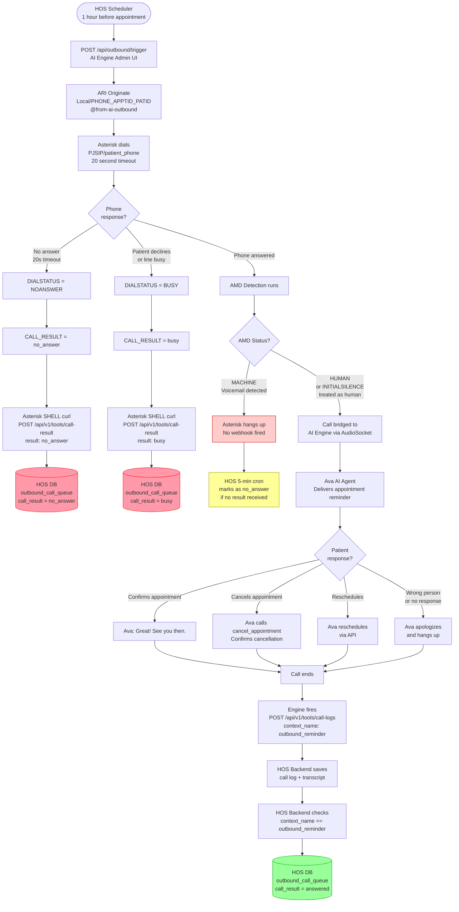

# Outbound Appointment Reminder — Complete System Documentation

**Version:** 1.0  
**Date:** 2026-06-19  
**Scope:** Outbound call queue, AMD, result reporting to HOS backend

---

## Table of Contents

1. [Overview](#overview)
2. [System Components](#system-components)
3. [Complete Call Flow](#complete-call-flow)
4. [Flowchart](#flowchart)
5. [Component Details](#component-details)
   - [HOS Backend Trigger](#1-hos-backend-trigger)
   - [Asterisk Dialplan](#2-asterisk-dialplan)
   - [AMD Detection](#3-amd-answering-machine-detection)
   - [AI Engine](#4-ai-engine)
   - [Result Reporting](#5-result-reporting)
6. [Webhook Endpoints](#webhook-endpoints)
7. [HOS Backend Implementation Required](#hos-backend-implementation-required)
8. [Database Schema](#database-schema)
9. [Result Value Reference](#result-value-reference)
10. [Testing Checklist](#testing-checklist)
11. [Environment Variables (.env)](#environment-variables-env)
12. [Asterisk Dialplan (extensions_custom.conf)](#asterisk-dialplan-extensions_customconf)

---

## Overview

The outbound reminder system automatically calls patients one hour before their appointment to confirm attendance. The system:

- Dials the patient phone number from the HOS scheduler
- Uses **AMD (Answering Machine Detection)** to avoid leaving messages on voicemail
- Connects a live patient to the **AI voice agent (Ava)** who delivers the reminder
- Reports the call result (`no_answer`, `busy`, `answered`) back to the HOS backend
- Logs the full call transcript via the call-logs webhook

---

## System Components

| Component | Role |
|---|---|
| **HOS Backend** | Schedules calls, triggers the AI engine, receives call results |
| **AI Engine Admin UI** | Receives trigger HTTP request, originates call via Asterisk ARI |
| **Asterisk PBX** | Dials the patient, runs AMD, bridges audio to AI engine |
| **AI Engine** | Hosts the AI voice agent (Ava), handles conversation |
| **HOS Backend Webhooks** | Receives call result and call log after call ends |

---

## Complete Call Flow

### Scenario A — No Answer (patient does not pick up)

```
HOS Backend (scheduler)
    → POST /api/outbound/trigger  (AI Engine Admin UI)
        → ARI originate  Local/6002_29_3@from-ai-outbound
            → Asterisk dials PJSIP/6002  (20 second timeout)
                → [rings for 20 seconds, no answer]
                    → DIALSTATUS = NOANSWER
                        → Asterisk SHELL curl
                            → POST /api/v1/tools/call-result  {result: "no_answer"}
                                → HOS Backend updates outbound_call_queue
```

### Scenario B — Busy / Declined

```
HOS Backend (scheduler)
    → POST /api/outbound/trigger  (AI Engine Admin UI)
        → ARI originate  Local/6002_29_3@from-ai-outbound
            → Asterisk dials PJSIP/6002
                → [patient declines / line busy]
                    → DIALSTATUS = BUSY
                        → Asterisk SHELL curl
                            → POST /api/v1/tools/call-result  {result: "busy"}
                                → HOS Backend updates outbound_call_queue
```

### Scenario C — Voicemail (answering machine detected)

```
HOS Backend (scheduler)
    → POST /api/outbound/trigger  (AI Engine Admin UI)
        → ARI originate  Local/6002_29_3@from-ai-outbound
            → Asterisk dials PJSIP/6002
                → [voicemail picks up after ~4 rings]
                    → AMD detects MACHINE
                        → Asterisk hangs up immediately (no webhook fired)
                            → HOS Backend 5-minute cron marks as no_answer
```

### Scenario D — Patient Answers (human detected)

```
HOS Backend (scheduler)
    → POST /api/outbound/trigger  (AI Engine Admin UI)
        → ARI originate  Local/6002_29_3@from-ai-outbound
            → Asterisk dials PJSIP/6002
                → [patient picks up]
                    → AMD detects HUMAN (or INITIALSILENCE treated as human)
                        → Call bridged to AI Engine (AudioSocket)
                            → Ava greets patient and delivers reminder
                                → [conversation ends, call hangs up]
                                    → Engine fires POST /api/v1/tools/call-logs
                                        → HOS Backend saves transcript
                                        → HOS Backend sees context_name = "outbound_reminder"
                                            → HOS Backend internally updates call_result = "answered"
```

---

## Flowchart



---

## Component Details

### 1. HOS Backend Trigger

**Endpoint called:** `POST http://<AI_ENGINE_IP>:3003/api/outbound/trigger`

**Authentication:** `X-Api-Key` header (shared secret, set in `.env` as `OUTBOUND_TRIGGER_API_KEY`)

**Request body:**

```json
{
  "phone_number":     "6002",
  "patient_id":       "3",
  "patient_name":     "Jalilur Rahman",
  "appointment_id":   "29",
  "doctor_name":      "Dr. Nusrat Jahan",
  "appointment_date": "2026-06-20",
  "start_time":       "09:00",
  "context":          "outbound_reminder"
}
```

**Response:**

```json
{
  "ok": true,
  "channel_id": "Local/6002_29_3@from-ai-outbound-00000007;1",
  "phone_number": "6002",
  "context": "outbound_reminder",
  "message": "Outbound call initiated"
}
```

---

### 2. Asterisk Dialplan

**Context:** `[from-ai-outbound]`  
**File:** `/etc/asterisk/extensions_custom.conf`

The dialplan encodes `appointment_id` and `patient_id` in the extension string so they are available during dialplan execution:

```
Local/6002_29_3@from-ai-outbound
       │    │  └─ patient_id = 3
       │    └──── appointment_id = 29
       └───────── phone = 6002
```

The dialplan then:
1. Parses these values using `CUT()`
2. Dials the patient with a 20-second timeout
3. Runs AMD via `U(sub-amd-check,s,1)` on the answered channel
4. If not answered: fires `curl` webhook with `no_answer` or `busy`
5. If answered + human: bridges to AI engine

**Hangup handler (`exten => h`)** catches the case where the call is interrupted (e.g., AI engine resets) and fires `no_answer` as a safety net.

---

### 3. AMD (Answering Machine Detection)

AMD runs on the called party channel immediately after they answer, **before** audio is bridged to the AI engine.

**Parameters used:** `AMD(2000, 2000, 1000, 5000)`

| Parameter | Value | Meaning |
|---|---|---|
| Initial silence | 2000ms | Max silence before first word |
| Greeting | 2000ms | Max length of greeting |
| After greeting silence | 1000ms | Silence after greeting = human |
| Total analysis time | 5000ms | Hard timeout |

**Decision logic:**

```
AMDCAUSE starts with "TOOLONG"      → treat as HUMAN (long greeting = human)
AMDCAUSE starts with "INITIALSILENCE" → treat as HUMAN (patient picking up silently)
AMDSTATUS = "HUMAN"                 → treat as HUMAN → bridge to AI
AMDSTATUS = "MACHINE"               → hang up immediately → no webhook
AMDSTATUS = "NOTSURE"               → hang up immediately → no webhook
```

> **Why INITIALSILENCE = HUMAN?**  
> When a patient answers but hasn't spoken yet (2 seconds of silence), AMD labels it `MACHINE` with cause `INITIALSILENCE`. This is actually a human picking up and waiting to hear who is calling. The dialplan overrides this to treat it as human so the AI can greet them.

---

### 4. AI Engine

**Context:** `outbound_reminder`  
**Provider:** Deepgram Voice Agent  
**Transport:** AudioSocket (TCP port 8090)

When a human is detected, Asterisk bridges the call to the AI engine. The engine:

1. Receives patient data (name, doctor, appointment date/time) from call arguments
2. Injects them into the AI prompt as `APPOINTMENT DETAILS`
3. Ava greets the patient: *"Hello, may I speak with [patient_name]?"*
4. Handles the conversation (confirm / cancel / reschedule / wrong person)
5. After call ends, fires the post-call webhook (`smart_doctor_call_log`)

**Tools available to Ava during the call:**

| Tool | Purpose |
|---|---|
| `cancel_appointment` | Cancels the appointment if patient requests |
| `hangup_call` | Ends the call cleanly |
| `transfer` | Transfers to reception if needed |

---

### 5. Result Reporting

There are **two paths** for reporting results back to HOS:

#### Path A — Dialplan direct webhook (no_answer / busy)

Fired by Asterisk `SHELL()` function immediately after the call fails:

```bash
curl -s -X POST http://168.144.27.225/api/v1/tools/call-result \
  -H 'Content-Type: application/json' \
  -H 'X-Tenant-ID: 1' \
  -H 'X-API-Key: dev-api-key-replace-in-production' \
  --data '{"appointmentId":"29","result":"no_answer","patientId":"3"}' \
  --max-time 5
```

#### Path B — Post-call log webhook (answered)

Fired by the AI engine after the call transcript is ready:

```
POST /api/v1/tools/call-logs
{context_name: "outbound_reminder", appointmentId: "29", patientId: "3", ...}
```

The HOS backend detects `context_name = "outbound_reminder"` and internally updates `call_result = "answered"`.

---

## Webhook Endpoints

### `POST /api/v1/tools/call-result`

Fired by: **Asterisk dialplan** (for `no_answer` and `busy`)

**Headers:**
```
Content-Type: application/json
X-Tenant-ID: 1
X-API-Key: <secret>
```

**Request body:**
```json
{
  "appointmentId": "29",
  "result":        "no_answer",
  "patientId":     "3"
}
```

**Valid `result` values:**

| Value | When |
|---|---|
| `no_answer` | Phone rang 20s with no answer |
| `busy` | Patient declined / line busy |
| `answered` | Patient answered, AI spoke to them *(set internally by call-logs handler)* |

**Expected response:** `200 OK` with `{"success": true}`

---

### `POST /api/v1/tools/call-logs`

Fired by: **AI Engine** after every answered call ends

**Headers:**
```
Content-Type: application/json
X-Tenant-ID: 1
X-API-Key: <secret>
```

**Request body (outbound_reminder example):**
```json
{
  "sessionId":        "Local/6002_29_3@from-ai-outbound-00000007;1",
  "callerPhone":      "6002",
  "patientId":        "3",
  "appointmentId":    "29",
  "context_name":     "outbound_reminder",
  "status":           "completed",
  "startedAt":        "2026-06-19T09:00:00Z",
  "endedAt":          "2026-06-19T09:02:30Z",
  "durationSeconds":  150,
  "aiConfidenceAvg":  0,
  "humanTransferred": false,
  "transferReason":   "",
  "outcome":          "completed",
  "transcript":       [
    {"role": "assistant", "content": "Hello, may I speak with Jalilur Rahman?"},
    {"role": "user",      "content": "Yes, speaking."},
    {"role": "assistant", "content": "I am calling to remind you of your appointment..."}
  ]
}
```

---

## HOS Backend Implementation Required

### Change 1 — Add `answered` as valid result in `call-result` endpoint

The validation for `/api/v1/tools/call-result` currently accepts `no_answer` and `busy`.  
Add `answered` as a valid value.

```java
// Valid result values
List<String> VALID_RESULTS = List.of("no_answer", "busy", "answered");
```

---

### Change 2 — Handle `outbound_reminder` in `call-logs` endpoint

Inside the existing `/api/v1/tools/call-logs` handler, add:

```java
// After saving call log normally...
if ("outbound_reminder".equals(request.getContextName())) {
    String appointmentId = request.getAppointmentId();
    String patientId     = request.getPatientId();

    if (appointmentId != null && !appointmentId.isEmpty()
        && patientId != null && !patientId.isEmpty()) {

        // Patient answered — dialplan already handled busy/no_answer
        outboundCallQueueRepository.updateCallResult(
            Long.parseLong(appointmentId),
            "answered",
            LocalDateTime.now()
        );
        
        log.info("Outbound reminder answered: appointmentId={} patientId={}", 
                 appointmentId, patientId);
    }
}
```

---

### Change 3 — Add `call_result` column to `outbound_call_queue`

```sql
ALTER TABLE outbound_call_queue 
ADD COLUMN call_result          VARCHAR(20)  NULL,
ADD COLUMN call_result_updated_at TIMESTAMP NULL;
```

Repository method:

```java
@Modifying
@Query("""
    UPDATE OutboundCallQueue q
    SET q.callResult = :result, q.callResultUpdatedAt = :updatedAt
    WHERE q.appointmentId = :appointmentId
""")
void updateCallResult(
    @Param("appointmentId") Long appointmentId,
    @Param("result")        String result,
    @Param("updatedAt")     LocalDateTime updatedAt
);
```

---

### Change 4 — 5-Minute Timeout Cron (fallback for voicemail)

For calls where AMD detects a machine (voicemail), Asterisk hangs up silently — no webhook fires. The cron handles this.

```java
@Scheduled(fixedDelay = 60_000)  // run every 60 seconds
public void markStaleOutboundCalls() {
    LocalDateTime cutoff = LocalDateTime.now().minusMinutes(5);
    
    outboundCallQueueRepository
        .findByCallResultIsNullAndCreatedAtBefore(cutoff)
        .forEach(record -> {
            record.setCallResult("no_answer");
            record.setCallResultUpdatedAt(LocalDateTime.now());
            outboundCallQueueRepository.save(record);
            log.info("Cron: marked stale outbound call as no_answer: appointmentId={}", 
                     record.getAppointmentId());
        });
}
```

---

## Database Schema

### `outbound_call_queue` table

```sql
CREATE TABLE outbound_call_queue (
    id                    BIGINT PRIMARY KEY AUTO_INCREMENT,
    appointment_id        BIGINT       NOT NULL,
    patient_id            BIGINT       NOT NULL,
    patient_name          VARCHAR(255),
    patient_phone         VARCHAR(50),
    doctor_name           VARCHAR(255),
    appointment_date      DATE,
    start_time            TIME,
    status                VARCHAR(20)  DEFAULT 'PENDING',  -- PENDING, TRIGGERED, DONE
    call_result           VARCHAR(20)  NULL,               -- no_answer, busy, answered
    call_result_updated_at TIMESTAMP  NULL,
    created_at            TIMESTAMP    DEFAULT CURRENT_TIMESTAMP,
    triggered_at          TIMESTAMP    NULL
);
```

---

## Result Value Reference

| `call_result` | Who sets it | Meaning |
|---|---|---|
| `no_answer` | Asterisk dialplan SHELL curl | Phone rang 20s, nobody answered |
| `busy` | Asterisk dialplan SHELL curl | Patient declined or line was busy |
| `answered` | HOS backend (from call-logs handler) | Patient answered, AI spoke to them |
| `no_answer` *(fallback)* | HOS 5-min cron | Voicemail answered (AMD detected), or unknown failure |

---

## Testing Checklist

### Backend Team

- [ ] `POST /api/v1/tools/call-result` accepts `result: "no_answer"` → returns `200 OK`
- [ ] `POST /api/v1/tools/call-result` accepts `result: "busy"` → returns `200 OK`
- [ ] `POST /api/v1/tools/call-result` accepts `result: "answered"` → returns `200 OK` (new)
- [ ] `POST /api/v1/tools/call-result` with empty `appointmentId` → returns `400`
- [ ] `POST /api/v1/tools/call-logs` with `context_name: "outbound_reminder"` → `call_result` set to `answered` in DB
- [ ] `POST /api/v1/tools/call-logs` with `context_name: "default"` → no change to `outbound_call_queue`
- [ ] 5-minute cron runs and marks unresolved records as `no_answer`

### End-to-End Testing

| Test scenario | Expected `call_result` in DB | How to test |
|---|---|---|
| Call a phone that does not answer | `no_answer` | Trigger call to an unregistered extension |
| Call a phone that declines | `busy` | Trigger call, press reject on the phone |
| Call a phone that answers and patient confirms | `answered` | Trigger call, answer the phone, say "yes" |
| Call a number that goes to voicemail | `no_answer` (via cron) | Trigger call, let it ring through to voicemail |

---

## No Changes Required In

- Asterisk dialplan (already complete)
- AI Engine configuration (already complete)
- `/api/outbound/trigger` endpoint (already works)
- `/api/v1/tools/call-logs` endpoint structure (only add logic inside handler)
- Any authentication or headers

---

## Environment Variables (.env)

The following variables must be set in the AI Engine `.env` file on the server.  
File location: `/opt/asterisk-ai-voice-agent/.env` (or wherever the engine is deployed)

### Required — Asterisk Connection

```env
# Asterisk server IP (same machine or LAN IP)
ASTERISK_HOST=127.0.0.1

# ARI port (default 8088)
ASTERISK_ARI_PORT=8088

# ARI credentials (created in FreePBX → Settings → Asterisk REST Interface Users)
ASTERISK_ARI_USERNAME=asterisk
ASTERISK_ARI_PASSWORD=your_ari_password_here

# Stasis app name — must match dialplan Stasis() call
ASTERISK_APP_NAME=asterisk-ai-voice-agent
```

### Required — Outbound Trigger Security

```env
# Shared API key for POST /api/outbound/trigger
# HOS backend must send this in the X-Api-Key header
# Generate with: openssl rand -hex 32
OUTBOUND_TRIGGER_API_KEY=your-strong-random-key-here
```

### Required — Outbound Dialplan Routing

```env
# The Asterisk dialplan context that handles outbound reminder calls
# Must match the [context] name in extensions_custom.conf
AAVA_OUTBOUND_DIAL_CONTEXT=from-ai-outbound
```

### Required — AI Provider

```env
# Deepgram API key (used for STT + Voice Agent)
DEEPGRAM_API_KEY=your_deepgram_api_key_here
```

### Required — AudioSocket

```env
# IP address of the AI engine server (Asterisk must reach this)
# Used in extensions_custom.conf for AudioSocket connection
AUDIOSOCKET_HOST=192.168.0.170
AUDIOSOCKET_PORT=8090
```

### Optional — Caller ID shown to patient

```env
# Phone number shown on patient's phone when Ava calls
# If not set, defaults to "Smart Doctor Clinic"
AAVA_OUTBOUND_EXTENSION_IDENTITY=+923001234567
```

### Complete `.env` example (outbound-relevant entries only)

```env
# ── Asterisk ──────────────────────────────────────────
ASTERISK_HOST=127.0.0.1
ASTERISK_ARI_PORT=8088
ASTERISK_ARI_USERNAME=asterisk
ASTERISK_ARI_PASSWORD=StrongAriPassword123

# ── Outbound trigger ──────────────────────────────────
OUTBOUND_TRIGGER_API_KEY=a1b2c3d4e5f6a1b2c3d4e5f6a1b2c3d4e5f6a1b2c3d4e5f6a1b2c3d4e5f6a1b2
AAVA_OUTBOUND_DIAL_CONTEXT=from-ai-outbound
AAVA_OUTBOUND_EXTENSION_IDENTITY=+923001234567

# ── AudioSocket ───────────────────────────────────────
AUDIOSOCKET_HOST=192.168.0.170
AUDIOSOCKET_PORT=8090

# ── AI Provider ───────────────────────────────────────
DEEPGRAM_API_KEY=your_deepgram_key_here

# ── Admin UI ──────────────────────────────────────────
JWT_SECRET=your_jwt_secret_here
```

> **Security note:** Never commit `.env` to git. The file is in `.gitignore`.  
> Restart the AI engine after any `.env` change: `docker compose restart ai_engine`

---

## Asterisk Dialplan (extensions_custom.conf)

**File location on Asterisk server:** `/etc/asterisk/extensions_custom.conf`

After editing, reload with: `asterisk -rx "dialplan reload"`

> **How to apply in FreePBX:**  
> Admin → Config Edit → `extensions_custom.conf` → paste content → Save → Apply Config

```asterisk
; ═══════════════════════════════════════════════════════════════════
; INBOUND AI AGENT — default context
; Called via dialplan: Stasis(asterisk-ai-voice-agent)
; ═══════════════════════════════════════════════════════════════════
[from-ai-agent]
exten => s,1,NoOp(AI Agent Inbound Call)
 same => n,Set(AI_CONTEXT=default)
 same => n,Set(AI_PROVIDER=deepgram)
 same => n,Stasis(asterisk-ai-voice-agent)
 same => n,Hangup()

; ═══════════════════════════════════════════════════════════════════
; OUTBOUND REMINDER — entry context (called by from-ai-outbound)
; This is what the AI engine's Local;1 channel enters
; ═══════════════════════════════════════════════════════════════════
[from-outbound-reminder]
exten => s,1,NoOp(AI Outbound Reminder Entry)
 same => n,Set(AI_CONTEXT=outbound_reminder)
 same => n,Set(AI_PROVIDER=deepgram)
 same => n,Stasis(asterisk-ai-voice-agent)
 same => n,Hangup()

; ═══════════════════════════════════════════════════════════════════
; OUTBOUND DIALER — dials patient, runs AMD, fires result webhooks
;
; Extension format: PHONE_APPOINTMENTID_PATIENTID
; Example:          6002_29_3
;   CUT(EXTEN,_,1) = 6002  (phone number to dial)
;   CUT(EXTEN,_,2) = 29    (appointment ID)
;   CUT(EXTEN,_,3) = 3     (patient ID)
;
; This encodes appointment data into the extension string so the
; dialplan (Local;2 channel) can read it. ARI channel variables
; only reach the Stasis (Local;1) channel, not the dialplan side.
; ═══════════════════════════════════════════════════════════════════
[from-ai-outbound]
exten => _X.,1,NoOp(AI Outbound Reminder with AMD - raw exten=${EXTEN})
 same => n,Set(DIAL_NUMBER=${CUT(EXTEN,_,1)})
 same => n,Set(APPOINTMENT_ID=${CUT(EXTEN,_,2)})
 same => n,Set(PATIENT_ID=${CUT(EXTEN,_,3)})
 same => n,NoOp(DEBUG: phone=${DIAL_NUMBER} appt=${APPOINTMENT_ID} patient=${PATIENT_ID})
 same => n,Dial(PJSIP/${DIAL_NUMBER},20,U(sub-amd-check,s,1))
 same => n,NoOp(DIALSTATUS=${DIALSTATUS})
 same => n,GotoIf($["${DIALSTATUS}" = "ANSWER"]?done)
 same => n,Set(CALL_RESULT=${IF($["${DIALSTATUS}"="BUSY"]?busy:no_answer)})
 same => n,Set(IGNORED=${SHELL(curl -s -X POST http://168.144.27.225/api/v1/tools/call-result -H 'Content-Type: application/json' -H 'X-Tenant-ID: 1' -H 'X-API-Key: dev-api-key-replace-in-production' --data '{"appointmentId":"${APPOINTMENT_ID}","result":"${CALL_RESULT}","patientId":"${PATIENT_ID}"}' --max-time 5)})
 same => n,NoOp(HOS webhook result: ${IGNORED})
 same => n(done),Hangup()

; Hangup handler — fires if Local;1 (AI engine side) hangs up while
; Dial() is still running (e.g. engine timeout before patient answers).
; Safety net: fires no_answer webhook if CALL_RESULT was never set.
exten => h,1,NoOp(Hangup handler: DIALSTATUS=${DIALSTATUS} CALL_RESULT=${CALL_RESULT} APPT=${APPOINTMENT_ID})
 same => n,GotoIf($["${CALL_RESULT}" != ""]?done)
 same => n,GotoIf($["${DIALSTATUS}" = "ANSWER"]?done)
 same => n,GotoIf($["${APPOINTMENT_ID}" = ""]?done)
 same => n,Set(CALL_RESULT=no_answer)
 same => n,Set(IGNORED=${SHELL(curl -s -X POST http://168.144.27.225/api/v1/tools/call-result -H 'Content-Type: application/json' -H 'X-Tenant-ID: 1' -H 'X-API-Key: dev-api-key-replace-in-production' --data '{"appointmentId":"${APPOINTMENT_ID}","result":"${CALL_RESULT}","patientId":"${PATIENT_ID}"}' --max-time 5)})
 same => n,NoOp(HOS hangup webhook: ${IGNORED})
 same => n(done),NoOp(Hangup handler done)

; ═══════════════════════════════════════════════════════════════════
; AMD SUB-ROUTINE — runs on the called party channel after they answer
; Called via U(sub-amd-check,s,1) option in Dial()
;
; AMD parameters: AMD(initial_silence, greeting, after_greeting_silence, total_analysis_time)
;   2000ms initial silence  — max silence before first word
;   2000ms greeting         — max greeting duration
;   1000ms after silence    — silence after greeting = human
;   5000ms total            — hard cutoff
;
; INITIALSILENCE is treated as HUMAN because a patient picking up and
; waiting silently triggers this cause — it is NOT a machine.
; ═══════════════════════════════════════════════════════════════════
[sub-amd-check]
exten => s,1,NoOp(AMD detection running)
 same => n,AMD(2000,2000,1000,5000)
 same => n,NoOp(AMD: status=${AMDSTATUS} cause=${AMDCAUSE})
 same => n,GotoIf($["${AMDCAUSE:0:7}" = "TOOLONG"]?human)
 same => n,GotoIf($["${AMDCAUSE:0:14}" = "INITIALSILENCE"]?human)
 same => n,GotoIf($["${AMDSTATUS}" = "HUMAN"]?human)
 same => n,Hangup()
 same => n(human),Return()

; ═══════════════════════════════════════════════════════════════════
; INTERNAL EXTENSIONS — AI Agent routing for direct dial
; ═══════════════════════════════════════════════════════════════════
[from-internal-custom]
exten => 7000,1,NoOp(Intercept ext 7000 -> AI IVR Main)
 same => n,Set(AI_CONTEXT=ivr_main)
 same => n,Set(AI_PROVIDER=deepgram)
 same => n,Stasis(asterisk-ai-voice-agent)
 same => n,Hangup()

exten => 7001,1,NoOp(Intercept ext 7001 -> AI Appointments)
 same => n,Set(AI_CONTEXT=ivr_appointments)
 same => n,Set(AI_PROVIDER=deepgram)
 same => n,Stasis(asterisk-ai-voice-agent)
 same => n,Hangup()

exten => 7002,1,NoOp(Intercept ext 7002 -> AI New Appointment)
 same => n,Goto(from-ai-agent,s,1)

exten => 7003,1,NoOp(Intercept ext 7003 -> AI Reschedule)
 same => n,Set(AI_CONTEXT=ivr_reschedule)
 same => n,Set(AI_PROVIDER=deepgram)
 same => n,Stasis(asterisk-ai-voice-agent)
 same => n,Hangup()

exten => 7004,1,NoOp(Intercept ext 7004 -> AI Cancel)
 same => n,Set(AI_CONTEXT=ivr_cancel)
 same => n,Set(AI_PROVIDER=deepgram)
 same => n,Stasis(asterisk-ai-voice-agent)
 same => n,Hangup()

exten => 8000,1,NoOp(Intercept ext 8000 -> AI Outbound Reminder)
 same => n,Goto(from-outbound-reminder,s,1)
```

### Key Points About the Dialplan

| Item | Detail |
|---|---|
| **Extension pattern** | `_X.` matches any string starting with a digit — covers `6002_29_3` format |
| **Dial timeout** | 20 seconds — Asterisk hangs up before voicemail typically answers (~25–30s) |
| **AMD option** | `U(sub-amd-check,s,1)` — runs the subroutine on the **called party** channel after answer, before bridging |
| **SHELL curl** | Fires the `call-result` webhook directly from Asterisk without going through the AI engine |
| **Hangup handler** | `exten => h` — catches interrupted calls where `Dial()` never returned normally |
| **HOS backend IP** | `168.144.27.225` — update this if the HOS server IP changes |
| **API key in dialplan** | `dev-api-key-replace-in-production` — update to match `X-API-Key` header the HOS backend expects |

### After Any Dialplan Change

```bash
# Option 1 — reload dialplan only (no service restart needed)
asterisk -rx "dialplan reload"

# Option 2 — verify the context loaded correctly
asterisk -rx "dialplan show from-ai-outbound"

# Option 3 — verify AMD module is loaded
asterisk -rx "module show like app_amd"
```
