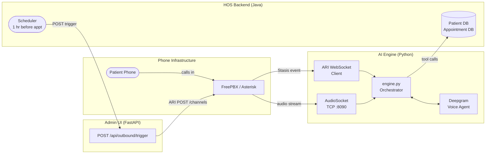

# Smart Doctor Clinic — AI Voice Agent Flowcharts

Complete call-flow diagrams for the inbound appointment booking flow and the
outbound reminder call flow.

---

## Table of Contents

1. [System Overview](#1-system-overview)
2. [Inbound Call — Appointment Booking](#2-inbound-call--appointment-booking)
   - [Pre-call & Patient Identification (STATE 1)](#state-1--patient-identification)
   - [Doctor Selection (STATE 2)](#state-2--doctor-selection)
   - [Date Selection (STATE 3)](#state-3--date-selection)
   - [Serial Confirmation (STATE 4)](#state-4--serial-confirmation)
   - [Booking Confirmed (STATE 5)](#state-5--booking-confirmed)
   - [Call End (STATE 6)](#state-6--call-end)
3. [Outbound Call — Appointment Reminder](#3-outbound-call--appointment-reminder)
   - [Trigger & Channel Origination](#trigger--channel-origination)
   - [Patient Conversation Flow](#patient-conversation-flow)
4. [Full End-to-End Flow](#4-full-end-to-end-flow)
5. [Data Flow — Variables & Tools](#5-data-flow--variables--tools)

---

## 1. System Overview



---

## 2. Inbound Call — Appointment Booking

A patient calls the clinic number.  
Ava identifies them, helps choose a doctor, selects a date, confirms the serial
number, books the appointment, and optionally saves a reminder call request.

### Full Inbound Flow

```mermaid
flowchart TD
    START([Patient dials clinic number]) --> PBX

    subgraph ASTERISK["Asterisk / FreePBX"]
        PBX[Dialplan: from-ai-agent\nStasis asterisk-ai-voice-agent]
    end

    PBX --> SESSION[Engine creates CallSession\nAudioSocket connected]
    SESSION --> PRECALL

    subgraph PRECALL_BLOCK["Pre-call Phase"]
        PRECALL[name_look_up\nPOST /api/v1/tools/patients/lookup\nbody: caller_number]
        PRECALL --> LOOKUP_OK{lookup_success\n= true?}
    end

    LOOKUP_OK -->|Yes — known patient| S2_ENTRY
    LOOKUP_OK -->|No — new patient| S1

    subgraph STATE1["STATE 1 — Patient Identification"]
        S1[Ask: Could I have your full name?]
        S1 --> REG[register_patient\nPOST /api/v1/tools/patients/register\nbody: fullName + phone]
        REG --> REG_OK{Registration\nsucceeded?}
        REG_OK -->|Yes| STORE_ID[Store reg_patient_id as patient_id]
        REG_OK -->|No| S1_RETRY[Apologize, ask again]
        S1_RETRY --> S1
        STORE_ID --> S2_ENTRY
    end

    subgraph STATE2["STATE 2 — Doctor Selection"]
        S2_ENTRY[fetch_doctor_list\nGET /api/v1/tools/doctors]
        S2_ENTRY --> S2_READ[Read doctor names aloud\ne.g. Dr. Hina Farooqi General Physician\nand Dr. Zaid Ansari Cardiologist]
        S2_READ --> S2_PICK[Patient chooses a doctor]
        S2_PICK --> STORE_DOC[Store doctor_id and doctor_name]
    end

    STORE_DOC --> S3_ENTRY

    subgraph STATE3["STATE 3 — Date Selection"]
        S3_ENTRY[Ask: What date would you like?]
        S3_ENTRY --> S3_CONV[Convert spoken date to YYYY-MM-DD\nToday = {today}]
        S3_CONV --> S3_CONFIRM[Confirm: So that is Day Month Date\nwith Doctor Name. Correct?]
        S3_CONFIRM --> S3_OK{Patient says\nYes?}
        S3_OK -->|No| S3_ENTRY
        S3_OK -->|Yes| SERIAL[get_next_serial\nGET /api/v1/tools/appointments/next-serial\nparams: doctor_id + date]
        SERIAL --> SERIAL_OK{API call\nsucceeded?}
        SERIAL_OK -->|No| SERIAL_FAIL[Apologize, ask if different date]
        SERIAL_FAIL --> S3_ENTRY
        SERIAL_OK -->|Yes| STORE_SERIAL[Store next_serial and estimated_time]
    end

    STORE_SERIAL --> S4_ENTRY

    subgraph STATE4["STATE 4 — Serial Confirmation"]
        S4_ENTRY["Say: Serial [next_serial], est. time [estimated_time]\non [Date] with [Doctor]. Shall I confirm?"]
        S4_ENTRY --> S4_OK{Patient says\nYes?}
        S4_OK -->|No — different date| S3_ENTRY
        S4_OK -->|Yes| BOOK[book_appointment\nPOST /api/v1/tools/appointments\nbody: patientId + doctorId + date]
        BOOK --> BOOK_OK{Booking\nsucceeded?}
        BOOK_OK -->|No| BOOK_FAIL[Apologize, ask if different date]
        BOOK_FAIL --> S3_ENTRY
        BOOK_OK -->|Yes| STORE_BOOK[Store appointment_id\nconfirmation_code, start_time, serial_number]
    end

    STORE_BOOK --> S5_ENTRY

    subgraph STATE5["STATE 5 — Booking Confirmed"]
        S5_ENTRY["Say: Confirmed. Code [confirmation_code].\n[Day Date] at [start_time], serial [serial_number], with [Doctor]."]
        S5_ENTRY --> ASK_REMIND[Ask: Would you like a reminder call\none hour before your appointment?]
        ASK_REMIND --> REMIND_OK{Patient says\nYes?}
        REMIND_OK -->|Yes| FOLLOWUP[save_followup_request\nPOST /api/v1/tools/follow-ups\nbody: appointmentId + patientId + CALL + 60min]
        FOLLOWUP --> SAY_REMIND[Say: Perfect! We will call you\none hour before your appointment.]
        REMIND_OK -->|No| SAY_NO[Say: No problem!]
        SAY_REMIND --> ASK_ELSE
        SAY_NO --> ASK_ELSE
        ASK_ELSE[Ask: Is there anything else\nI can help you with?]
        ASK_ELSE --> ELSE_OK{Patient needs\nmore help?}
        ELSE_OK -->|Cancel appointment| CANCEL_CONFIRM[Ask: Are you sure you want to cancel?]
        CANCEL_CONFIRM --> CANCEL_YES{Patient\nconfirms?}
        CANCEL_YES -->|Yes| CANCEL_CALL[cancel_appointment\nPOST /api/v1/tools/appointments/cancel\nbody: appointmentId + PATIENT_REQUEST]
        CANCEL_CALL --> S6
        CANCEL_YES -->|No| ASK_ELSE
        ELSE_OK -->|Reschedule| S3_ENTRY
        ELSE_OK -->|Nothing else| S6
    end

    subgraph STATE6["STATE 6 — Call End"]
        S6[Say warm farewell]
        S6 --> HANGUP[hangup_call]
        HANGUP --> POSTCALL[Post-call: smart_doctor_call_log\nPOST /api/v1/tools/call-logs]
        POSTCALL --> END([Call ended])
    end
```

---

## 3. Outbound Call — Appointment Reminder

The HOS backend Java scheduler fires 1 hour before each appointment.
Ava calls the patient, confirms their identity, delivers the reminder,
and handles cancel / reschedule / confirmation on the spot.

### Trigger & Channel Origination

```mermaid
flowchart TD
    SCHED([HOS Scheduler\nT-minus 60 min]) --> HTTP

    subgraph ADMINUI["Admin UI — FastAPI :3003"]
        HTTP[POST /api/outbound/trigger\nHeader: X-Api-Key]
        HTTP --> AUTHCK{API key\nvalid?}
        AUTHCK -->|No key set| E503[503 — Trigger disabled\nSet OUTBOUND_TRIGGER_API_KEY]
        AUTHCK -->|Wrong key| E401[401 — Unauthorized]
        AUTHCK -->|Valid| ENCODE[Encode patient data in appArgs\nformat: outbound_reminder,\npatient_name=X|doctor_name=Y|...]
        ENCODE --> ORIGINATE
    end

    subgraph ARI["Asterisk ARI"]
        ORIGINATE["POST /ari/channels\nURL params: endpoint=Local/phone@from-internal\napp=asterisk-ai-voice-agent\nappArgs=outbound_reminder,patient_name=...\ntimeout=60\ncallerId=Smart Doctor Clinic"]
        ORIGINATE --> LOCAL[Asterisk creates Local channel pair\nLocal;2 — dialplan side\nLocal;1 — enters Stasis]
        LOCAL --> STASIS[StasisStart fires\nargs[0]=outbound_reminder\nargs[1]=patient_name=X|doctor_name=Y|...]
    end

    subgraph ENGINE["AI Engine"]
        STASIS --> PARSE[Parse args[1]\nExtract patient data dict]
        PARSE --> CACHE[Cache in _outbound_reminder_vars\nkeyed by channel_id]
        CACHE --> SETCTX[Set AI_CONTEXT=outbound_reminder\non channel]
        SETCTX --> HYBRID[_handle_caller_stasis_start_hybrid\nLoad outbound_reminder context]
        HYBRID --> PRESEED[Pop from _outbound_reminder_vars\nPre-seed session.pre_call_results\npatient_name, doctor_name, appointment_date\nstart_time, appointment_id, patient_id]
        PRESEED --> GREETING[Greeting: Hello, may I speak\nwith patient_name?]
    end

    ORIGINATE --> RESP[Returns 200 + channel_id]
    RESP --> CALLER_RESP[OutboundTriggerResponse\nok=true, channel_id, phone, context]
```

### Patient Conversation Flow

```mermaid
flowchart TD
    GREETING[Ava: Hello, may I speak with patient_name?] --> IDENTITY

    subgraph STEP1["STEP 1 — Confirm Patient Identity"]
        IDENTITY{Who answers?}
        IDENTITY -->|It is the patient| STEP2_ENTRY
        IDENTITY -->|Wrong person| WRONG[Apologize, say will call back]
        IDENTITY -->|No answer| NO_ANS[No response]
        WRONG --> HUP1[hangup_call]
        NO_ANS --> HUP1
    end

    subgraph STEP2["STEP 2 — Deliver Reminder"]
        STEP2_ENTRY["Say: I am calling to remind you of your\nappointment with doctor_name\non appointment_date at start_time.\nWill you be able to make it?"]
    end

    STEP2_ENTRY --> STEP3

    subgraph STEP3["STEP 3 — Handle Response"]
        STEP3{Patient response?}

        STEP3 -->|Will attend| CONFIRM_PATH
        STEP3 -->|Cancel| CANCEL_PATH
        STEP3 -->|Reschedule| RESCHEDULE_PATH
        STEP3 -->|Busy / wrong time| BUSY_PATH

        subgraph CONFIRM_PATH["a) Confirm"]
            CONF_SAY["Say: Great! We look forward to seeing you.\nIs there anything else I can help you with?"]
            CONF_SAY --> CONF_ELSE{Anything\nelse?}
            CONF_ELSE -->|No| HUP2[hangup_call]
            CONF_ELSE -->|Yes| CONF_SAY
        end

        subgraph CANCEL_PATH["b) Cancel"]
            CAN_SAY[Say: I understand. Let me cancel that.]
            CAN_SAY --> CAN_TOOL[cancel_appointment\nPOST /api/v1/tools/appointments/cancel\nbody: appointmentId + PATIENT_REQUEST]
            CAN_TOOL --> CAN_OK{Cancel\nsucceeded?}
            CAN_OK -->|Yes| CAN_DONE["Say: Appointment cancelled. Have a good day."]
            CAN_OK -->|No| CAN_FAIL["Say: Could not cancel. Please call the clinic."]
            CAN_DONE --> HUP3[hangup_call]
            CAN_FAIL --> HUP3
        end

        subgraph RESCHEDULE_PATH["c) Reschedule"]
            RESCH_ASK[Ask: What date would you like?]
            RESCH_ASK --> RESCH_SERIAL[get_next_serial\nGET /api/v1/tools/appointments/next-serial\nparams: doctor_id + new_date]
            RESCH_SERIAL --> RESCH_AVAIL{Slot\navailable?}
            RESCH_AVAIL -->|No| RESCH_ASK
            RESCH_AVAIL -->|Yes| RESCH_CONFIRM["Say: Slot available on [new date] at [time].\nShall I reschedule?"]
            RESCH_CONFIRM --> RESCH_YES{Patient\nagrees?}
            RESCH_YES -->|No| RESCH_ASK
            RESCH_YES -->|Yes| RESCH_TOOL["reschedule_appointment\nPATCH /api/v1/appointments/id/reschedule\nbody: doctorId + newAppointmentDate"]
            RESCH_TOOL --> RESCH_OK{Reschedule\nsucceeded?}
            RESCH_OK -->|Yes| RESCH_DONE["Say: Rescheduled to [new date] at [time]. Goodbye."]
            RESCH_OK -->|No| RESCH_FAIL["Say: Could not reschedule. Please call the clinic."]
            RESCH_DONE --> HUP4[hangup_call]
            RESCH_FAIL --> HUP4
        end

        subgraph BUSY_PATH["d) Busy / Wrong time"]
            BUSY_SAY["Say: No problem. Please call us\nat your convenience. Goodbye."]
            BUSY_SAY --> HUP5[hangup_call]
        end
    end
```

---

## 4. Full End-to-End Flow

How the two call types connect across the full system lifetime of one appointment.

```mermaid
sequenceDiagram
    actor Patient
    participant PBX as FreePBX / Asterisk
    participant Engine as AI Engine
    participant Deepgram as Deepgram Voice Agent
    participant Backend as HOS Backend API

    Note over Patient,Backend: ── INBOUND: Patient books appointment ──────────────────────

    Patient->>PBX: Calls clinic number
    PBX->>Engine: StasisStart (inbound)
    Engine->>Backend: name_look_up (caller_number)
    Backend-->>Engine: {success, patient_name, patient_id}
    Engine->>Deepgram: Start session (default context + pre_call_results)
    Deepgram->>Patient: Greeting / STATE 1

    Patient->>Deepgram: Gives name (if not found)
    Deepgram->>Engine: Tool: register_patient
    Engine->>Backend: POST /patients/register
    Backend-->>Engine: {reg_patient_id}

    Patient->>Deepgram: Chooses doctor
    Deepgram->>Engine: Tool: fetch_doctor_list
    Engine->>Backend: GET /doctors
    Backend-->>Engine: [{id, fullName, specialty}]

    Patient->>Deepgram: Confirms date
    Deepgram->>Engine: Tool: get_next_serial
    Engine->>Backend: GET /appointments/next-serial
    Backend-->>Engine: {nextSerial, estimatedTime}

    Patient->>Deepgram: Confirms booking
    Deepgram->>Engine: Tool: book_appointment
    Engine->>Backend: POST /appointments
    Backend-->>Engine: {id, confirmationCode, startTime, serialNumber}

    Deepgram->>Patient: Appointment confirmed + reminder question

    Patient->>Deepgram: Yes to reminder call
    Deepgram->>Engine: Tool: save_followup_request
    Engine->>Backend: POST /tools/follow-ups
    Backend-->>Engine: {id, success}

    Deepgram->>Patient: Farewell
    Deepgram->>Engine: Tool: hangup_call
    Engine->>Backend: POST /tools/call-logs (post-call)
    Engine->>PBX: Hangup channel

    Note over Patient,Backend: ── OUTBOUND: Reminder call 1 hour before ───────────────────

    Backend->>Engine: POST /api/outbound/trigger (X-Api-Key)\n{phone, patient_name, doctor_name, appointment_date, start_time, appointment_id}
    Engine->>PBX: ARI POST /channels\nLocal/phone@from-internal\nappArgs=outbound_reminder,patient_name=...
    PBX->>Engine: StasisStart (Local;1)\nargs[0]=outbound_reminder args[1]=patient data
    Engine->>Engine: Parse + cache patient data
    Engine->>Deepgram: Start session (outbound_reminder context + pre_call_results)
    PBX->>Patient: Phone rings

    Deepgram->>Patient: Hello, may I speak with patient_name?
    Patient->>Deepgram: Yes, speaking
    Deepgram->>Patient: Reminder: appointment with doctor_name on date at time
    Patient->>Deepgram: Yes I will attend / Cancel / Reschedule

    alt Patient cancels
        Deepgram->>Engine: Tool: cancel_appointment
        Engine->>Backend: POST /appointments/cancel
        Backend-->>Engine: {status, confirmationCode}
        Deepgram->>Patient: Appointment cancelled. Goodbye.
    else Patient reschedules
        Deepgram->>Engine: Tool: get_next_serial (new date)
        Engine->>Backend: GET /appointments/next-serial
        Deepgram->>Engine: Tool: reschedule_appointment
        Engine->>Backend: PATCH /appointments/id/reschedule
        Backend-->>Engine: {new startTime, serialNumber}
        Deepgram->>Patient: Rescheduled. Goodbye.
    else Patient confirms
        Deepgram->>Patient: Great! See you then. Goodbye.
    end

    Deepgram->>Engine: Tool: hangup_call
    Engine->>PBX: Hangup channel
```

---

## 5. Data Flow — Variables & Tools

Which variables are produced and consumed at each stage.

```mermaid
flowchart LR
    subgraph PRE["Pre-call Tools"]
        NL[name_look_up]
    end

    subgraph VARS1["Variables After Pre-call"]
        V1["lookup_success\npatient_name\npatient_id\npatient_phone\npatient_status"]
    end

    subgraph IN1["In-call: Registration"]
        RP[register_patient]
        V2["reg_patient_id ← used as patient_id\nreg_patient_name\nreg_patient_code"]
    end

    subgraph IN2["In-call: Doctors"]
        FD[fetch_doctor_list]
        V3["doctors_list\n  id → stored as doctor_id\n  fullName → doctor_name\n  specialty"]
    end

    subgraph IN3["In-call: Serial"]
        GS[get_next_serial]
        V4["next_serial\nestimated_time"]
    end

    subgraph IN4["In-call: Booking"]
        BA[book_appointment]
        V5["appointment_id\nconfirmation_code\nstart_time\nserial_number\nappointment_status"]
    end

    subgraph IN5["In-call: Reminder"]
        SF[save_followup_request]
        V6["followup_saved\nfollowup_id"]
    end

    subgraph IN6["In-call: Cancel / Reschedule"]
        CA[cancel_appointment]
        RA[reschedule_appointment]
        V7["cancel_success\ncancel_status\ncancel_confirmation_code"]
        V8["reschedule_success\nnew_appointment_id\nnew_confirmation_code\nnew_start_time\nnew_serial_number"]
    end

    subgraph POST["Post-call Tools"]
        CL[smart_doctor_call_log]
    end

    NL --> VARS1
    VARS1 -->|lookup_success=false| RP
    RP --> V2
    VARS1 -->|lookup_success=true| FD
    V2 --> FD
    FD --> V3
    V3 -->|doctor_id + date| GS
    GS --> V4
    V4 -->|patient_id + doctor_id + date| BA
    BA --> V5
    V5 -->|appointment_id + patient_id| SF
    SF --> V6
    V5 -->|appointment_id| CA
    CA --> V7
    V5 -->|appointment_id + doctor_id + new_date| RA
    RA --> V8
    V5 --> CL
    V7 --> CL
    V8 --> CL
```



---

## Quick Reference

### Inbound Context — Tool Call Order

| Step | State | Tool | Endpoint | Trigger |
|------|-------|------|----------|---------|
| Pre-call | — | `name_look_up` | POST `/tools/patients/lookup` | Every inbound call |
| 1 | Patient ID | `register_patient` | POST `/tools/patients/register` | `lookup_success = false` |
| 2 | Doctor select | `fetch_doctor_list` | GET `/tools/doctors` | Entry into STATE 2 |
| 3 | Date select | `get_next_serial` | GET `/tools/appointments/next-serial` | Patient confirms date |
| 4 | Serial confirm | `book_appointment` | POST `/tools/appointments` | Patient says Yes |
| 5 | Confirmed | `save_followup_request` | POST `/tools/follow-ups` | Patient wants reminder |
| 5 | Confirmed | `cancel_appointment` | POST `/tools/appointments/cancel` | Patient wants to cancel |
| 5 | Confirmed | `reschedule_appointment` | PATCH `/appointments/{id}/reschedule` | Patient wants new date |
| 6 | End | `hangup_call` | — | Farewell |
| Post-call | — | `smart_doctor_call_log` | POST `/tools/call-logs` | Always |

### Outbound Context — Tool Call Order

| Step | Tool | Endpoint | Trigger |
|------|------|----------|---------|
| Originate | ARI `/channels` | POST `/ari/channels` | HOS scheduler |
| 3b | `cancel_appointment` | POST `/tools/appointments/cancel` | Patient wants to cancel |
| 3c | `get_next_serial` | GET `/tools/appointments/next-serial` | Patient wants to reschedule |
| 3c | `reschedule_appointment` | PATCH `/appointments/{id}/reschedule` | New date confirmed |
| Any | `hangup_call` | — | Terminal action |

### Key Environment Variables

| Variable | Used By | Purpose |
|----------|---------|---------|
| `OUTBOUND_TRIGGER_API_KEY` | Admin UI | Authenticates HOS backend M2M calls |
| `ASTERISK_HOST` | Admin UI + Engine | ARI host |
| `ASTERISK_ARI_PORT` | Admin UI + Engine | ARI port (default 8088) |
| `ASTERISK_APP_NAME` | Admin UI + Engine | Stasis app name |
| `AAVA_OUTBOUND_DIAL_CONTEXT` | Admin UI | Dialplan context for outbound (default `from-internal`) |
| `AAVA_OUTBOUND_EXTENSION_IDENTITY` | Admin UI | Caller ID shown to patient |
