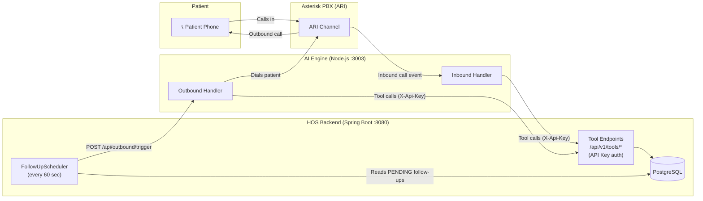
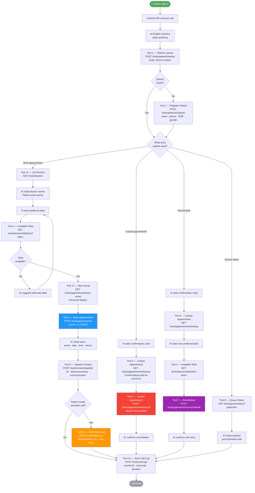
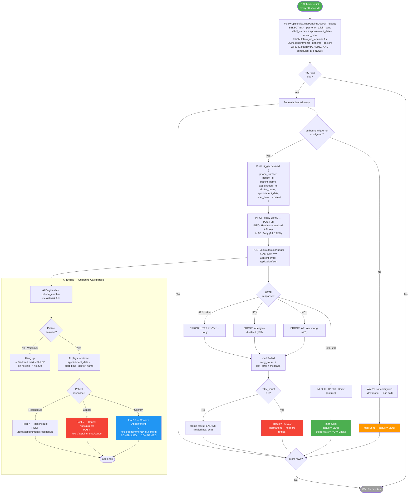
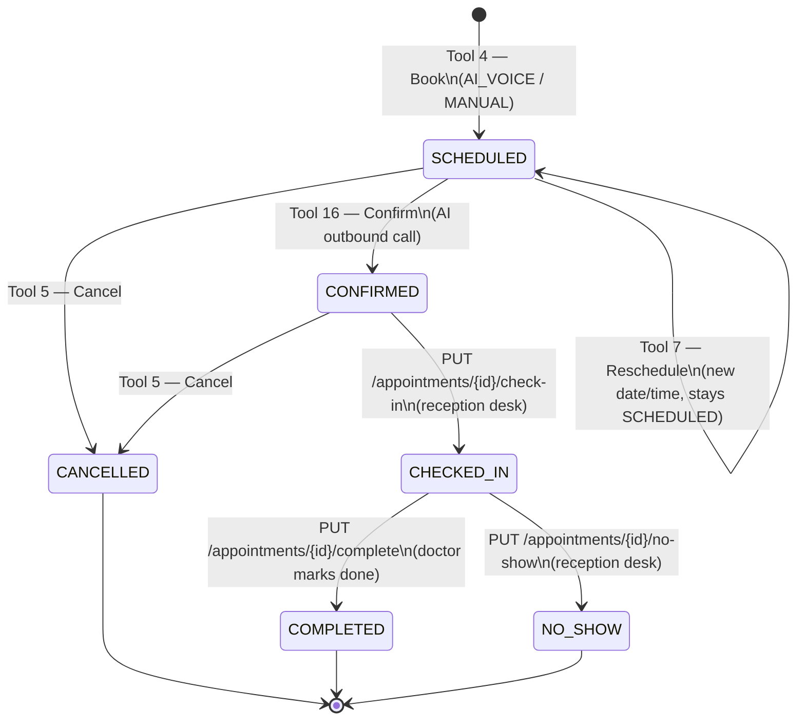
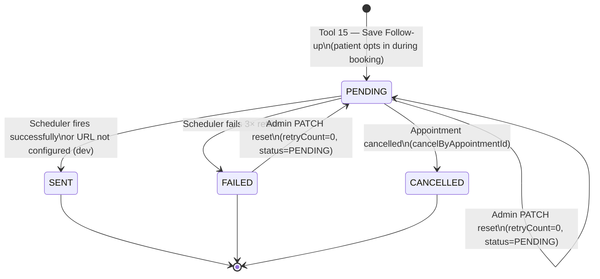
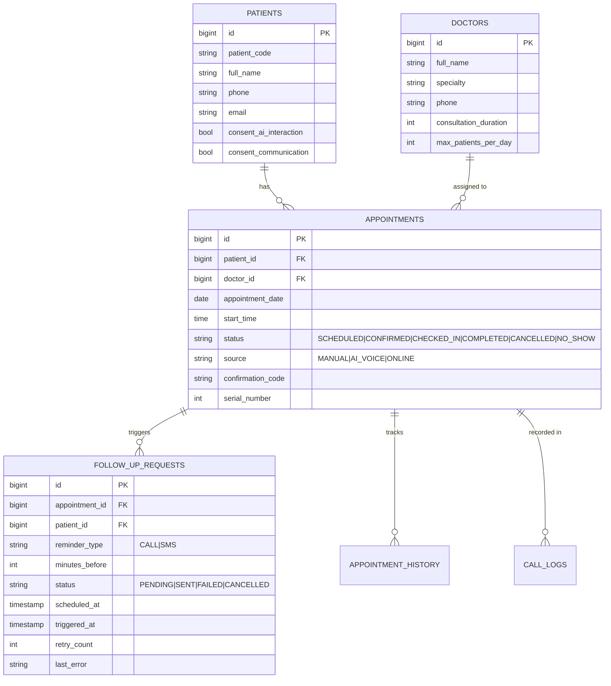

# Appointment Booking & Reminder Flow

> Complete end-to-end flow for the AI Hospital Operating System —  
> inbound voice booking + outbound reminder call.

---

## 1. System Overview



---

## 2. Inbound Booking Flow



---

## 3. Outbound Reminder Flow



---

## 4. Appointment Status State Machine



---

## 5. Follow-up Request Status



---

## 6. Tool Reference

| # | Method | Path | Purpose |
|---|--------|------|---------|
| 1 | POST | `/tools/patients/lookup` | Find patient by phone or patient code |
| 2 | POST | `/tools/patients/register` | Register new patient |
| 3 | GET | `/tools/doctors/{id}/slots` | Available time slots for a doctor on a date |
| 4 | POST | `/tools/appointments` | Book an appointment (source forced to `AI_VOICE`) |
| 5 | POST | `/tools/appointments/cancel` | Cancel an appointment |
| 6 | GET | `/tools/appointments/lookup` | Find appointment by confirmation code |
| 7 | POST | `/tools/appointments/reschedule` | Move appointment to new date/time |
| 8 | GET | `/tools/queue/status` | Patient queue position today |
| 9 | POST | `/tools/consent/update` | Record patient consent flags |
| 10 | PATCH | `/tools/patients/{id}` | Update patient profile |
| 11 | GET | `/tools/doctors` | List active doctors |
| 12 | GET | `/tools/appointments` | List appointments by doctor + date |
| 13 | POST | `/tools/call-logs` | Save completed call session + transcript |
| 14 | GET | `/tools/appointments/next-serial` | Next serial number for doctor on date |
| 15 | POST | `/tools/follow-ups` | Save patient's reminder call preference |
| 16 | PUT | `/tools/appointments/{id}/confirm` | Confirm appointment (SCHEDULED → CONFIRMED) |

> **Auth:** All tool endpoints require `X-Api-Key` header + `X-Tenant-ID` header.  
> **JWT endpoints** (`/api/v1/appointments`, `/api/v1/follow-ups`, etc.) require `Authorization: Bearer <token>`.

---

## 7. Configuration Quick Reference

```properties
# ── Follow-up Scheduler ──────────────────────────────────────────────────
app.followup.outbound-trigger-url=http://192.168.0.170:3003/api/outbound/trigger
app.followup.outbound-trigger-api-key=your-strong-random-key-here
app.followup.scheduler-fixed-delay-ms=60000   # poll every 60 s
app.followup.timezone=Asia/Dhaka              # all LocalDateTime comparisons
app.followup.enabled=true                     # set false to disable scheduler bean

# ── Notification Scheduler (SMS reminders) ──────────────────────────────
app.notification.retry-delay-ms=86400000      # 24 h between retries (prod)
app.notification.reminder-cron=-              # disable cron scheduler (prod workaround)

# ── Frontend polling ─────────────────────────────────────────────────────
VITE_NOTIFICATION_POLL_MS=60000               # 0 = disable notification bell polling
```

---

## 8. Data Flow Diagram


